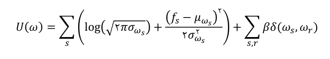
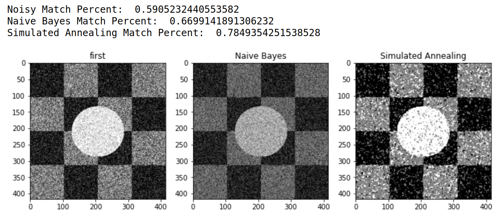
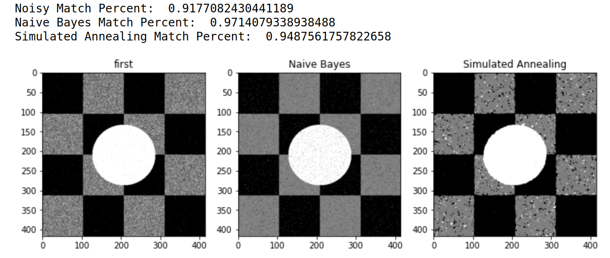
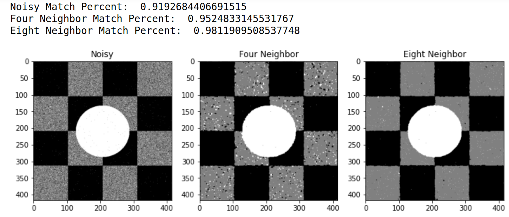
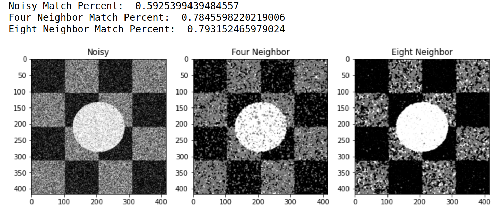
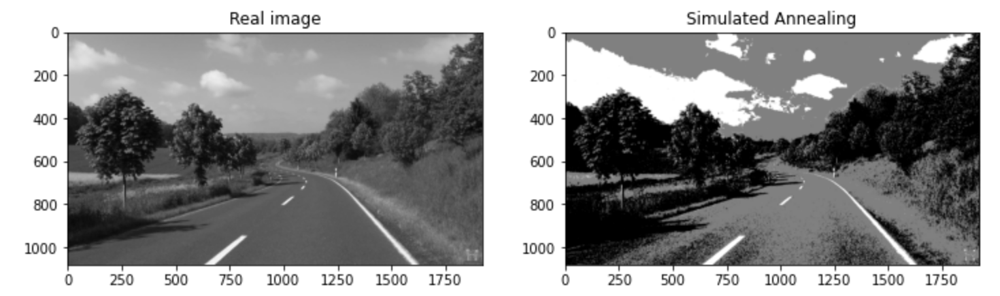
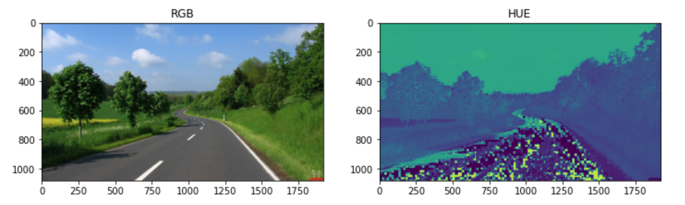
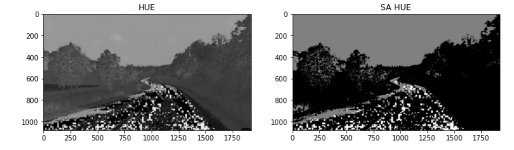
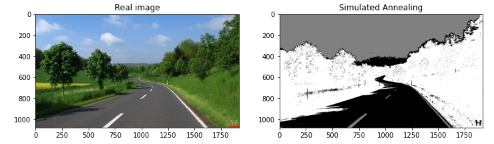

# Image Segmentation and Noise Reduction using Markov Random Field (MRF)

This is the [final project](./documents/PGMS20_P1.pdf) of Probabilistic Graphical Models.

In the first part, We try to reduce image noise using a Markov Random Field model. We compared the result with a Naive Bayes model. In the second part, We use MRF to segment an image.

In MRF model, for each pixel we can define some surrounding pixels as its neighbors[(Ref)](./documents/Markov_Random_Fields_in_Image_Segmentation.pdf). We can use a simulated annealing strategy to optimise final result. The energy function of our MRF model:

* [Codes](./codes)
* [Notebooks](notebooks)
* [Additional Documents](./documents)

## Image Noise Reduction

## Image Segmentation

We used three different color spaces to achieve the best result. Grayscale, HSV, RGB Format

